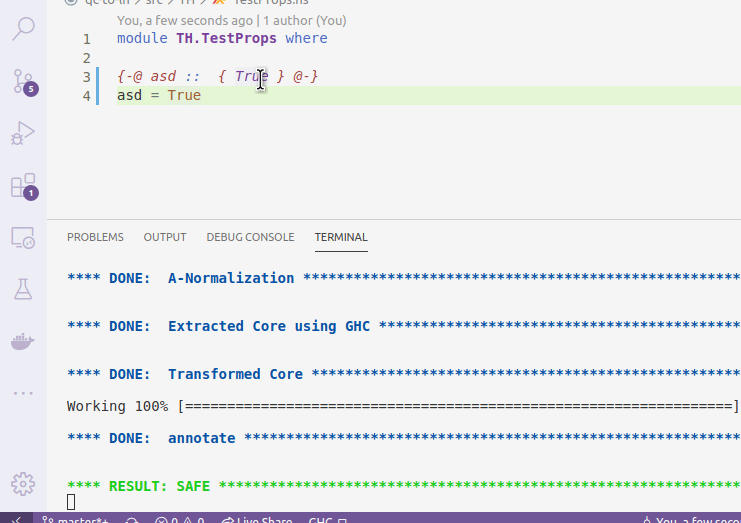

# liquidhaskell-diagnostics

This extension runs and shows [LiquidHaskell's](https://github.com/ucsd-progsys/liquidhaskell) errors in VScode "Problems" section and underlines the corresponding code.

## Requirements

- You need to open the folder containing your code in vscode for this extension to work
