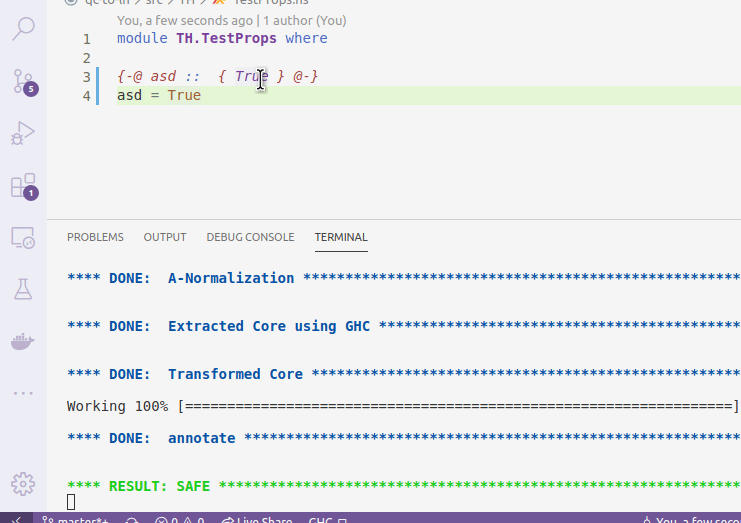

# liquidhaskell-diagnostics

This (very simple) extension shows [LiquidHaskell's](https://github.com/ucsd-progsys/liquidhaskell) errors in VScode "Problems" section and underlines the corresponding code.

## Requirements

`liquid` must be running in the background.

This extension is simply based on the `.liquid` dirs that LiquidHaskell generates, so make sure to not delete those if you want to see the errors.
